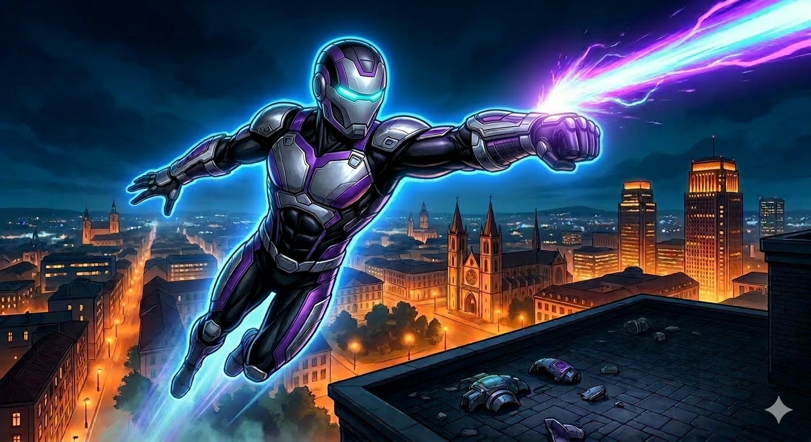

# 🚀 The Flight of Intenso

## Part I: The Story

By day, Nicolás was a brilliant student who had recently graduated in mechanical engineering and computer science. He was more intelligent than most people his age and always enjoyed solving complex problems. One rainy Tuesday, while he was working alone in the university lab, he noticed a glowing, purple rock inside a glass case.

By accident, he touched it. Suddenly, the rock jumped and attached itself to Nicolás’s wrist! He tried to pull it off, but it could not be moved. He realized that the rock was creating a powerful energy that could be directed. Since he is a genius, he started building a high-tech metal shell over the rock. This shell made it look like a normal watch so that it could be hidden. When activated, the device directed energy streams to help him fly.

However, success has not been easy. Nicolás has already fallen many times while testing his invention. "If I don't balance the power, I will crash again," he thought. After several weeks of fixing the "watch," he finally made it work.

One night, he flew over Almáriz, his hometown. The city, which was usually quiet, looked beautiful from above. He was flying silently through the clouds when he saw the glowing streetlights below. He realized he should use his powers for good. He told himself, "I am going to be a night vigilante." It was the most exciting moment of his life.

---

## Part II: 25 Practice Questions

### Reading Understanding

1. Where exactly was Nicolás when he found the rock?

2. How did the rock get onto Nicolás's wrist?

3. What was the main problem Nicolás faced during his first few tests?

4. Why did Nicolás design the shell to look like a watch?

5. Based on the end of the story, what is Nicolás’s new goal?

### Grammar Focus: Multiple Choice
6. Nicolás **___** in the lab when the accident happened. **a)** works, **b)** was working, **c)** has worked
7. The rock **___** be moved, even though Nicolás tried very hard. **a)** shouldn't, **b)** might not, **c)** could not
8. Nicolás found that flying was **___** he had imagined. **a)** difficult than, **b)** more difficult than, **c)** the most difficult
9. If Nicolás **___** the energy, he crashes. **a)** doesn't balance, **b)** won't balance, **c)** didn't balance
10. He **___** many different designs for the metal shell. **a)** tries, **b)** was trying, **c)** has tried

### Grammar Focus: Fill-in-the-Gaps (One word only)
11. Almáriz is the town **___** Nicolás lives.
12. He usually goes to the lab **___** night.
13. The rock attached **___** to his wrist.
14. Nicolás **___** gives up, even when he falls.
15. He found **___** amazing space rock in the laboratory.
16. There weren't **___** people in the university that night.
17. He decided **___** build a shell for the rock.

### Grammar Focus: Sentence Transformation (Use 1-3 words)
18. "The rock was found by Nicolás." ➡️ Nicolás **___** the rock.
19. "I am a vigilante," said Nicolás. ➡️ Nicolás said he **___** a vigilante.
20. "He plans to protect the city." ➡️ He **___** protect the city.
21. "It is necessary for him to study the rock." ➡️ He **___** study the rock.
22. "Where is the lab?" ➡️ He asked where the **___**.
23. "No flight was better than this one." ➡️ This was **___** flight.
24. "The watch belongs to him." ➡️ The watch is **___**.
25. "Study hard and you will pass." ➡️ If you **___** hard, you will pass.
