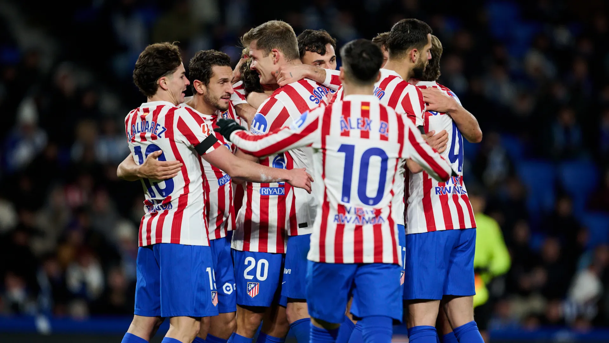

# 🏟️ The Red and White Heart: A Night at the Metropolitano

## Part I: The Story

The rain was pouring down on the grass of the Metropolitano Stadium. It was a cold Wednesday night, and the atmosphere was heavy. Atlético de Madrid, the home team, was facing a very difficult situation. The scoreboard showed a painful reality: 1-4. There were only ten minutes left in the match, and many fans had already started to leave their seats, thinking the game was over.

However, the players on the pitch did not look like they wanted to quit. Koke, the captain, gathered the team in a small circle during a break. "It doesn't matter if we lose," he shouted over the noise of the crowd. "What matters is how we finish. We fight together until the last second!"

Something changed in that moment. It was as if a spark of lightning had hit the team. Suddenly, the players were running faster than they had been at the start of the match. They were tired, but their spirit was stronger than their exhaustion. Griezmann received the ball near the midfield. He looked up and saw his teammate sprinting toward the goal. With a perfect pass, he sent the ball flying through the air.

BOOM! The second goal went in. The score was now 2-4. The fans who were leaving stopped in their tracks and turned around. The roar of the stadium returned, louder than ever. Even though they still needed two more goals, the team felt a new energy. They were supporting each other, shouting encouragement, and defending like lions.

In the final minute of injury time, after a chaotic corner kick, the ball landed at the feet of a young defender. He didn't think; he just kicked it as hard as he could. The ball hit the back of the net. 3-4!

The referee blew the final whistle seconds later. Atlético had lost the match by one goal, but the players didn't drop to the ground in sadness. Instead, they hugged each other. They had faced a humilitating defeat and turned it into a display of courage and unity. As they walked toward the stands to thank the fans, the supporters weren't booing—they were cheering. In their hearts, they hadn't lost; they had won a battle of character.

---

## Part II: 25 Practice Questions

### Reading Understanding

1. What was the score of the match when there were only ten minutes left?
2. Why were some fans leaving the stadium before the match ended?
3. What did Koke tell his teammates during the break?
4. How did the fans react when the score became 2-4?
5. How did the players feel after the referee blew the final whistle?

### Grammar Focus: Multiple Choice

6. The players **___** very tired when the second half started. **a)** are, **b)** were, **c)** have been
7. Griezmann **___** the ball when he saw his teammate running. **a)** is holding, **b)** was holding, **c)** holds
8. This match was **___** the one they played last week. **a)** more exciting than, **b)** most exciting than, **c)** as exciting
9. If they **___** harder, they might have tied the game. **a)** try, **b)** will try, **c)** had tried
10. The team **___** a trophy yet this season, but they are playing well. **a)** hasn't won, **b)** didn't win, **c)** doesn't win

### Grammar Focus: Fill-in-the-Gaps (One word only)

11. The Metropolitano is the stadium **___** Atlético plays.
12. The players always train **___** the morning.
13. The captain told them to believe in **___**.
14. There were **___** many fans left in the stands at the very end.
15. It was **___** amazing comeback, even if they didn't win.
16. They have **___** lost a match with such a brave attitude before.
17. They decided **___** keep fighting until the end.

### Grammar Focus: Sentence Transformation (Use 1-3 words)

18. "The ball was kicked by the defender." ➡️ The defender **___** the ball.
19. "We are a great team," said Koke. ➡️ Koke said they **___** a great team.
20. "They plan to win the next trophy." ➡️ They **___** win the next trophy.
21. "It is necessary for the players to rest." ➡️ The players **___** rest.
22. "Is the coach happy?" ➡️ He asked if the coach **___**.
23. "No player is better than Griezmann." ➡️ Griezmann is **___** player.
24. "The red shirt belongs to me." ➡️ The red shirt is **___**.
25. "Run fast and you will catch the ball." ➡️ If you **___** fast, you will catch the ball.
