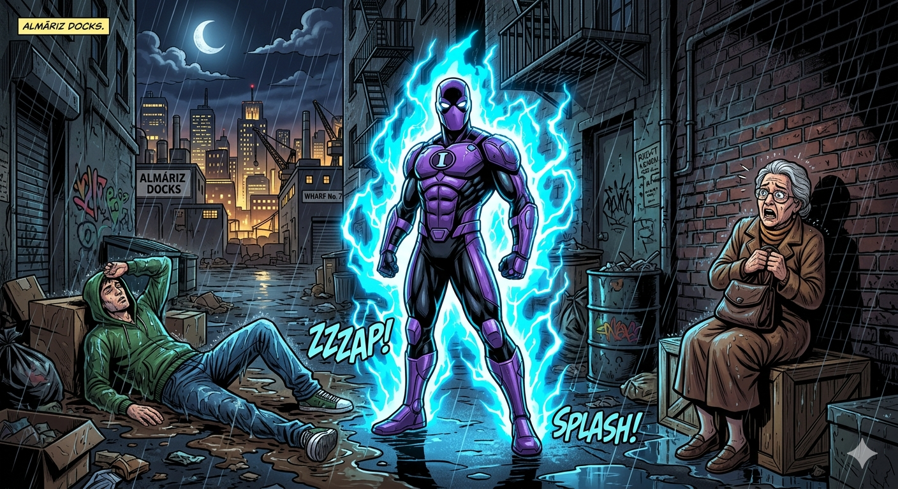

## 🦸‍♂️ Intenso: The Shadow of Almáriz

### Part I: The Story

The moon was bright over the quiet city of Almáriz. High above the streets, Nicolás—now called **Intenso**—was flying slowly. The metal "watch" on his wrist was working perfectly. It was his first night as a hero, and he felt very excited but also a bit nervous.

Nicolás had spent many weeks fixing his invention. He had finally learned how to control the purple rock’s power. "Being a student is easy," he thought, "but helping people is much more difficult."

Suddenly, he heard a loud noise. It was the sound of police cars! They were going toward the docks, near the sea. Intenso didn't wait. He flew through the clouds as fast as he could.

He arrived at a dark, narrow street. He saw a man in a black jacket trying to steal a bag from an old woman. The woman was shouting for help. 

"Stop!" Nicolás cried. 

The thief looked up and was very surprised to see a flying man. Nicolás wanted to stop the guy, so he pointed his wrist at him. He decided to use a small energy beam. "I will just hit his legs," he thought.

But the power was too strong. A bright purple light came out of the watch. It hit the thief with a lot of force. The man flew backward, over the wooden pier, and fell into the deep, cold water. 

Everything was silent. The man did not come back up to the surface.

"Oh no!" Nicolás said. His face turned white. "What have I done?"

In that moment, he didn't feel like a hero. He felt terrible. He didn't see a "bad guy" anymore; he saw a person who couldn't swim. Nicolás dived into the water. It was freezing, but he used his power to swim down fast. He grabbed the man's arm and pulled him up.

With a lot of effort, he put the thief on the ground. The man was breathing, but he was unconscious. Just then, the police arrived.

Nicolás looked at the woman and then at the man. He realized that he was not perfect. He had the power of a superhero, but he still needed to learn how to be kind and careful. This is called **humility**, he thought.

When the police got out of their cars, Nicolás didn't wait to say "hello." He didn't want to be famous. He felt a bit ashamed because he almost killed the man. He started his watch and flew away into the dark sky before anyone could see his face.

From that day, Nicolás decided to help people in secret. He didn't need everyone to know his name. He only wanted to do the right thing and be a good person.

---

### 📚 Expanded Vocabulary & Phrasal Verbs

**Key Vocabulary:**
* **Docks (noun):** The place by the water where boats stay.
* **Surface (noun):** The top part of the water.
* **Force (noun):** Physical power or strength.
* **Invention (noun):** Something new that someone has created (like Nicolás's watch).
* **Effort (noun):** When you try very hard to do something difficult.
* **Ashamed (adjective):** Feeling bad because you did something wrong.
* **Humility (noun):** The quality of not thinking you are better than other people.
* **Unconscious (adjective):** Appearing to be asleep because of an injury.

**Essential Phrasal Verbs:**
* **Go toward:** To move in the direction of something.
* **Come out:** To move from inside to outside (like the light from the watch).
* **Come back:** To return.
* **Get out (of):** To leave a car, bus, or taxi.
* **Fly away:** To leave a place by flying.
* **Dive into:** To jump head-first into water.

---

### Part II: Practice Questions

#### Reading Understanding
1. How did Nicolás feel at the beginning of his flight?
2. Where were the police going after they turned on their sirens?
3. Why did the thief fall into the water?
4. What did Nicolás do after the thief fell into the sea?
5. Why did Nicolás decide to fly away when the police arrived?

#### Grammar Focus: Multiple Choice
6. While Nicolás **___** over the city, he heard a noise. **a)** flies, **b)** was flying, **c)** has flown
7. The energy beam was **___** Nicolás expected. **a)** powerful than, **b)** the most powerful, **c)** more powerful than
8. If he **___** the thief, the man would have drowned. **a)** didn't save, **b)** hasn't saved, **c)** hadn't saved
9. Nicolás **___** use his powers for fame in the future. **a)** won't, **b)** hasn't, **c)** doesn't
10. The police **___** at the docks yet when the thief fell. **a)** didn't arrive, **b)** hadn't arrived, **c)** aren't arriving

#### Grammar Focus: Fill-in-the-Gaps (One word only)
11. The docks are the place **___** the thief fell into the water.
12. Nicolás is interested **___** helping people in danger.
13. He dived into the water to save the man **___** himself.
14. There wasn't **___** time to call for help, so he jumped in.
15. He has **___** been so scared in his entire life.
16. The thief was saved **___** the young hero.
17. He needs to practice **___** order to control his beams.

#### Grammar Focus: Sentence Transformation (Use 1-3 words)
18. "The thief was hit by a purple beam." ➡️ A purple beam **___** the thief.
19. "I am sorry for my mistake," said Nicolás. ➡️ Nicolás said he **___** sorry for his mistake.
20. "It’s a good idea to be careful," the woman said. ➡️ You **___** be careful.
21. "He intends to stay in the shadows." ➡️ He **___** stay in the shadows.
22. "Where did the hero go?" ➡️ The police asked where the hero **___**.
23. "No city is as quiet as Almáriz." ➡️ Almáriz is the **___** city.
24. "That power belongs to the rock." ➡️ That is the **___** power.
25. "Nicolás found the thief in the alley." ➡️ The thief **___** by Nicolás in the alley.
26. "Don't use too much power," Lumina told him. ➡️ Lumina told him **___** use too much power.
27. "If you don't practice, you won't improve." ➡️ You won't improve **___** you practice.
