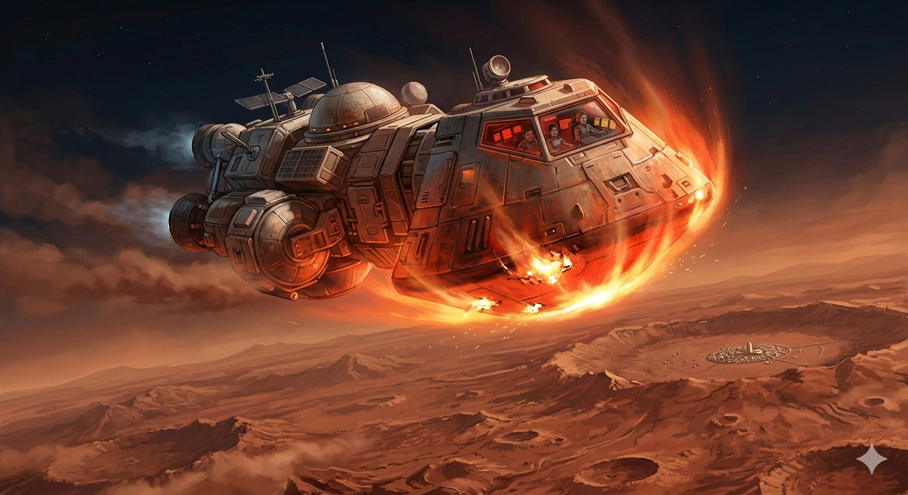

# 🚀 Mission to the Red Horizon

## Part I: The Story

The spacecraft *Ares One* had been traveling through the silent darkness of space for nearly 300 days. On board were ten brave settlers, the first group of humans sent to live permanently on Mars. They were tired, but as the red glow of the planet filled the windows, their excitement grew. They had spent a year dreaming of the moment their boots would touch the Martian dust.

"Approaching atmosphere in T-minus ten minutes," Commander Sarah announced. Suddenly, a loud, piercing alarm echoed through the cabin. A bright red light flashed on the control panel. "The heat shield!" shouted Leo, the lead engineer. "The sensors say it is failing. If it breaks during entry, the ship will burn up."

Because of the distance between Mars and Earth, communication takes twenty minutes to travel each way. When the message finally arrived from Mission Control on Earth, the voice sounded worried. "Ares One, this is Earth. The risk is too high. Abort the mission immediately. Use your remaining fuel to turn around and return home."

The cabin went silent. Returning to Earth meant another year in space and the failure of their dream. Sarah gathered the ten crew members in the center of the ship. "We have a choice," she said. "We can follow orders and go home, or we can find a way to fix this together."

They began to brainstorm. Leo looked at the technical diagrams. "If we move the liquid coolant from the main engines to the heat shield, the shield might stay strong enough," he suggested. "But there is a problem: the engines will get dangerously hot."

"What if we don't run the engines constantly?" suggested Maya, the pilot. "We can shut them down at short intervals. It will be a bumpy landing, but it will give the engines time to cool down."

The crew looked at each other. It was a huge risk, but they had worked too hard to quit now. They voted quickly: *they would stay*.

As the ship hit the Martian atmosphere, the outside of the craft turned bright orange. The ship shook violently. "Shutting down engines... now!" Maya yelled. For a few seconds, they fell through the sky in silence, then the engines roared back to life. They repeated this again and again.

Finally, with a heavy *thud*, the shaking stopped. Dust settled outside the windows. They had landed. They were the first humans on Mars, not because their equipment was perfect, but because their courage was.

---

# 📚 Vocabulary Hint

To help you understand the story, here are some useful words:

* **Settlers**: People who go to live in a new place or planet.
* **Heat Shield**: A protective layer on a spacecraft that stops it from burning when it hits an atmosphere.
* **Abort**: To stop a plan or mission because something has gone wrong.
* **Coolant**: A liquid used to keep a machine or engine from getting too hot.
* **Intervals**: Short periods of time between actions (e.g., stopping for 10 seconds every minute).
* **Resolution**: Being very firm in a decision; not giving up.
* **Thud**: The sound of a heavy object hitting the ground.

| Phrasal Verb | Meaning in the Story | Example |
| --- | --- | --- |
| **Go off** | To start making a loud noise (alarm/timer). | *The alarm **went off** at 7:00 AM.* |
| **Burn up** | To be completely destroyed by heat or fire. | *Meteors often **burn up** in the atmosphere.* |
| **Turn around** | To change direction to the opposite way. | *We forgot the map, so we had to **turn around**.* |
| **Look at** | To direct your eyes toward something to examine it. | *Please **look at** the whiteboard.* |
| **Shut down** | To stop a machine or computer from working. | *Remember to **shut down** your laptop at night.* |
| **Give up** | To stop trying to do something difficult. | *The puzzle was hard, but I didn't **give up**.* |

---

## Part II: 25 Practice Questions

### Reading Understanding

1. How long had the crew been traveling before they reached Mars?
2. Why did the alarm go off as they approached the planet?
3. Why did it take so long to hear from Mission Control on Earth?
4. What was the specific technical solution the crew created to save the ship?
5. Did the crew follow the instructions they received from Earth? Why or why not?

### Grammar Focus: Multiple Choice

6. The settlers **___** through space when the alarm started. **a)** travel, **b)** were traveling, **c)** have traveled
7. The crew realized they **___** fix the problem if they worked together. **a)** could, **b)** shouldn't, **c)** won't
8. The trip to Mars was **___** any journey in human history. **a)** long than, **b)** the longest, **c)** longer than
9. If they **___** the engines, the ship will explode. **a)** don't stop, **b)** didn't stop, **c)** won't stop
10. The commander **___** to Mars once before, many years ago. **a)** was, **b)** has been, **c)** is going

### Grammar Focus: Fill-in-the-Gaps (One word only)

11. Mars is the planet **___** the settlers want to live.
12. They always check the equipment **___** the morning.
13. The ten settlers decided to land the spacecraft by **___**.
14. There were **___** many problems that they almost gave up.
15. It was **___** incredible moment when the ship finally touched the ground.
16. They had **___** seen anything as beautiful as the red landscape.
17. The team decided **___** try the dangerous landing.

### Grammar Focus: Sentence Transformation (Use 1-3 words)

18. "The mission was aborted by Earth." ➡️ Earth **___** the mission.
19. "We are brave," said Leo. ➡️ Leo said they **___** brave.
20. "They plan to build a base." ➡️ They **___** build a base.
21. "It is necessary for the crew to be brave." ➡️ The crew **___** be brave.
22. "Is the shield working?" ➡️ He asked if the **___**.
23. "No mission is more important than this." ➡️ This is **___** mission.
24. "The spaceship belongs to the settlers." ➡️ The spaceship is **___**.
25. "Work as a team and you will succeed." ➡️ If you **___** as a team, you will succeed.
