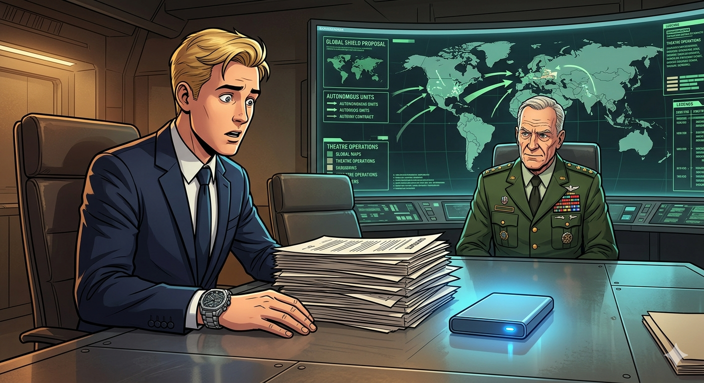

# 🤖 The Architect of a new era

## Part I: The Story

Nicolás had just finished the most important year of his life. After years of hard work, he graduated with honors in computer science and mechanical engineering. While other students were celebrating at the beach, Nicolás was in his small garage in Almáriz, staring at a wall of computer screens. He wasn't alone; he was talking to Lumos.

Lumos was a highly advanced Artificial Intelligence that Nicolás had built for his master's project. Although Lumos was a program, Nicolás always thought of the AI as a "she" because of her calm, logical voice. For months, Nicolás had been training Lumos to do something incredible: track and predict the movements of organized crime groups in the city. 

"Lumos, have you analyzed the latest police reports?" Nicolás asked, drinking a cold coffee.
"Yes, Nicolás," the AI replied. "I have identified three suspicious patterns in the northern district. If the police go there now, they will find the stolen goods."

Nicolás was sure that his technology could save the city. However, reality was much harder than coding. He had already gone through several rounds of fundraising, and he had presented Lumos to the middle management of the Almáriz Police Department six times. Every single time, the answer was the same: "It is too expensive," or "We don't trust machines."

On a rainy Monday, Nicolás walked out of the police station after his seventh rejection. He felt like giving up. He had shown great perseverance, but even the strongest person has a limit. As he walked toward the Mayor’s house to catch a bus, he noticed something strange. A large, black car was waiting at the entrance. Two men wearing dark suits and sunglasses stood next to it.

"Mr. Nicolás?" one of them asked. His voice was like ice. "Please, come with us. We have an offer you cannot refuse."

Nicolás was nervous, but his curiosity was stronger than his fear. He showed courage and stepped into the car. They drove for two hours until they reached a hidden valley far from the city. Behind a massive metal gate was a secret military installation. 

Inside, a high-ranking General was waiting. "We have watched your work, Nicolás," the General said, pointing to a giant map of southern Europe. "The police are small-minded. We want to fund Lumos, but our project is much more ambitious than tracking local thieves. We want to create a 'Regional Shield'—a system that coordinates every tank, ship, and fighter jet on Europe into one autonomous force."

Nicolás realized this was the moment that would change everything. The military was offering him more money than he could imagine. He would be the most powerful and richest man in Almáriz. However, he had to use his critical thinking. Was he ready to turn his helpful crime-tracker into a weapon of war? Was he ready to cause destruction and pain instead of preventing them?

The General pushed a thick stack of contracts toward him. "Sign these, and you will never have to worry about money again. *You will have the power to protect the entire planet.*"

That comment changed something inside him. He thought that he could really focus on protecting people rather than killing them. He believed that his AI would be far more effective in predicting where pain would happen than any human, so he really could make a difference.

Nicolás looked at the pen, then at the blue light of Lumos glowing on his portable drive. He knew that this path would be difficult and dangerous, but he also knew that he had worked too hard to walk away now. With a steady hand, he signed the first contract of a lifetime series. As he left the facility, he knew his life as a simple student was over. He was now the architect of a New Era.

---

## 📚 Vocabulary & Grammar Study List

### Key Vocabulary:
* **Graduated (verb):** To successfully finish a high school or university degree.
* **Funding (noun):** Money provided by an organization for a particular purpose.
* **Middle management (noun):** The managers in an organization who are below the top leaders but above the workers.
* **Rejected (adjective/verb):** When someone says "no" to an idea, person, or proposal.
* **Ambitious (adjective):** Having a strong desire to be successful or to do something big.
* **Autonomous (adjective):** Something that can work or move by itself without human control.
* **Warfare (noun):** The activity of fighting a war.
* **Installation (noun):** A place containing equipment or machinery for a specific purpose (often military).

### Phrasal Verbs:
* **Go through:** To experience a difficult situation or process.
* **Give up:** To stop trying to do something.
* **Walk away:** To leave a difficult situation instead of staying to solve it.
* **Set up:** To start or create a business or a system.

### Useful Expressions:
* **"Small-minded":** Not willing to accept new ideas.
* **"A stack of":** A large pile of something (like papers or books).
* **"To track":** To follow the progress or movement of something.

---

## Part II: Practice Questions (Refreshed)

### Reading Understanding
1. What was the primary goal of Lumos when Nicolás first developed her?
2. How many times did Nicolás try to present his project to the police before meeting the men in sunglasses?
3. Where was Nicolás waiting when the black car arrived?
4. In what way was the military's vision for Lumos different from a local crime-tracker?
5. Why did Nicolás need to use "critical thinking" before signing the papers?

### Grammar Focus: Multiple Choice
6. While Nicolás **___** the code, the lights in the garage flickered.
   **a)** finished  **b)** was finishing  **c)** has finished
7. The military base was **___** place Nicolás had ever seen.
   **a)** the most strange  **b)** strangest  **c)** the strangest
8. If Nicolás **___** the contract, he would have stayed poor.
   **a)** didn't sign  **b)** hadn't signed  **c)** hasn't signed
9. Lumos **___** to be the most powerful AI in history.
   **a)** is going  **b)** will  **c)** goes
10. Nicolás **___** very hard on this project since last year.
    **a)** works  **b)** was working  **c)** has worked

### Grammar Focus: Fill-in-the-Gaps (One word only)
11. Lumos is a program **___** can predict the future of crime.
12. Nicolás often stays awake **___** night to talk to the AI.
13. He **___** to be a simple student, but now he is a billionaire.
14. The General told Nicolás to believe in **___** and his invention.
15. There were **___** many rejections that he almost gave up.
16. He was very worried **___** the future of his technology.
17. It was **___** ambitious project that required a lot of money.

### Grammar Focus: Sentence Transformation (Use 1-3 words)
18. "The men in sunglasses drove Nicolás to the base." ➡️ Nicolás **___** to the base by the men.
19. "The police are not as powerful as the military." ➡️ The military is **___** than the police.
20. "Is Lumos ready?" the General asked. ➡️ The General asked if Lumos **___**.
21. "The project is too big for a small city." ➡️ The city is not **___** for the project.
22. "I plan to protect the world," said Nicolás. ➡️ Nicolás said he **___** to protect the world.
23. "The portable drive belongs to him." ➡️ That is **___** portable drive.
24. "You must sign the papers," the General said. ➡️ The General said Nicolás **___** to sign the papers.
25. "Work with us and you will be rich." ➡️ If you **___** with us, you will be rich.

