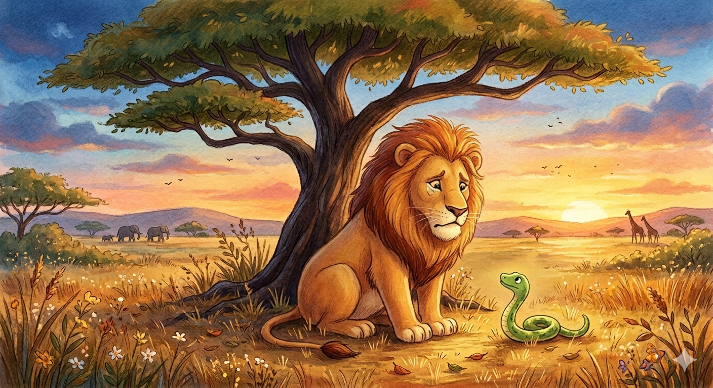

# 🦁 The Lion Who Was Alone

## Part I: The Story

Leo was the only lion in the savannah, and he had always wanted friends. He was kind and gentle, and he never understood why the other animals ran away when they saw him coming. "I just want to talk," he told himself every morning.

One sunny day, Leo was walking by the river when he spotted a zebra drinking water. He had never spoken to a zebra before, so he decided to try.

"Hello!" Leo called in his friendliest voice. "My name is Leo. Would you like to walk together?"

The zebra lifted his head quickly. His eyes were wide with fear. "Oh… hello, Leo," the zebra said slowly. "I would love to, but I am very busy today. I will come and find you tomorrow. I promise!"

But tomorrow never came. Leo waited by the river all morning, but the zebra never appeared.

A few days later, Leo met a rabbit near the tall grass. She was the most cheerful animal he had ever seen, and she was always singing to herself.

"Good morning!" said Leo. "I have been looking for someone to play with. Would you like to be my friend?"

The rabbit smiled nervously. "Of course! Friends are more important than anything. I am going to visit my family this afternoon, but I will come back very soon!" She hopped away quickly and never returned.

Leo felt sadder than ever. He sat alone under a big tree and wondered what was wrong with him. "If I were smaller, they might not be so afraid," he thought. "But I cannot change who I am."

One quiet evening, a long green snake appeared from the bushes. Leo had seen many animals run away, but the snake moved slowly and looked at him with calm eyes.

"You look lost," said the snake. "My name is Sila."

"I am not lost," Leo said. "I am just alone. My name is Leo. Every animal I meet promises to come back, but none of them ever do."

Sila was quiet for a moment. Then she said something that Leo had never heard before. "Leo, do you know why they don't come back? It is not because they dislike you. It is because they are afraid of you. When a zebra or a rabbit looks at a lion, they see a hunter. They see danger. They cannot help it — it is in their nature."

Leo was silent. He had never thought about it from their point of view. "But I would never hurt them," he said quietly.

"I know," said Sila. "And that is what makes this so hard. You are being judged by your appearance, not by your heart. That is unfair. But instead of giving up, you should observe the world more carefully. Not every animal sees you the same way."

Sila told Leo that she knew a group of tigers who lived on the other side of the mountain. "They are not afraid of you," she said. "They understand what it feels like to be misunderstood."

Leo decided to follow Sila. The journey was long and tiring, but it was also the bravest thing he had ever done.

When they arrived, three young tigers were playing near a waterfall. They stopped and looked at Leo. There was no fear in their eyes. One of them, a tiger called Raya, walked over and said, "Hello. I'm Raya. Who are you?"

"My name is Leo," the lion said.

Raya nodded. "We know what it feels like to be misunderstood, Leo. Welcome."

It was not perfect. Some of the tigers were unfriendly at first, and Leo had to work hard to show them who he really was. But he kept going. He had learned two important lessons: to observe before judging, and to keep trying even when things are difficult.

For the first time in a long while, Leo was not alone.

---

# 📚 Vocabulary Hint

* **Savannah (noun):** A large flat area of land with grass and few trees, found in Africa.
* **Gentle (adjective):** Calm and kind; not rough or violent.
* **Nervously (adverb):** In a way that shows you are worried or afraid.
* **Appeared (verb):** To come into sight; to show up suddenly.
* **Misunderstood (adjective):** When people form a wrong idea about who you are or what you mean.
* **Point of view (noun):** The way someone thinks about or sees a situation.
* **Judged (verb):** When someone decides what you are like based on how you look or what they think.
* **Resilience (noun):** The ability to keep going and stay strong after something difficult happens.

| Phrasal Verb | Meaning in the Story | Example |
| --- | --- | --- |
| **run away** | To leave a place quickly because of fear. | *The cat **ran away** when it heard the noise.* |
| **come back** | To return to a place or person. | *She promised to **come back** after dinner.* |
| **give up** | To stop trying to do something difficult. | *Don't **give up** — you can do it!* |
| **find out** | To discover or learn something you did not know. | *He wanted to **find out** why his friends were upset.* |
| **walk over** | To move toward someone in a relaxed way. | *The teacher **walked over** to help the student.* |

---

## Part II: 25 Practice Questions

### Reading Understanding

1. Why did Leo feel sad at the beginning of the story?
2. What did the zebra and the rabbit have in common after talking to Leo?
3. According to Sila, why did the animals not come back to see Leo?
4. What did Sila advise Leo to do instead of giving up?
5. How did Leo's life change at the end of the story? Was everything perfect?

### Grammar Focus: Multiple Choice

6. Leo **___** by the river when he saw the zebra for the first time.
   **a)** walks  **b)** was walking  **c)** has walked

7. The rabbit said that friends were **___** anything in the world.
   **a)** more important than  **b)** the most important than  **c)** important than

8. Leo **___** to a tiger before, so he was a little nervous.
   **a)** never spoke  **b)** has never spoken  **c)** never speaks

9. If Leo **___** smaller, the animals might not be so afraid.
   **a)** is  **b)** was  **c)** were

10. Sila said she **___** to introduce Leo to the tigers soon.
    **a)** is going  **b)** was going  **c)** goes

### Grammar Focus: Fill-in-the-Gaps (One word only)

11. Leo was the animal **___** had lived alone the longest.
12. He always waited **___** the morning for his new friends to return.
13. Leo told **___** that one day things would get better.
14. It was **___** unfair situation because Leo was kind but looked dangerous.
15. There were **___** many broken promises that Leo almost stopped trying.
16. Sila was not worried **___** Leo because she was not his prey.
17. Leo decided **___** follow Sila across the mountain.

### Grammar Focus: Sentence Transformation (Use 1-3 words)

18. "The other animals misunderstood Leo." ➡️ Leo **___** by the other animals.
19. "No animal in the savannah was lonelier than Leo." ➡️ Leo was **___** animal in the savannah.
20. "Is Leo dangerous?" the rabbit asked. ➡️ The rabbit asked if Leo **___** dangerous.
21. "You must observe the world more carefully," said Sila. ➡️ Sila said Leo **___** to observe the world more carefully.
22. "I plan to visit the tigers," said Leo. ➡️ Leo said he **___** to visit the tigers.
23. "The waterfall belongs to them." ➡️ The waterfall is **___**.
24. "Work hard and you will make friends." ➡️ If you **___** hard, you will make friends.
25. "The journey was too long for Leo to enjoy." ➡️ The journey was not **___** for Leo to enjoy.
