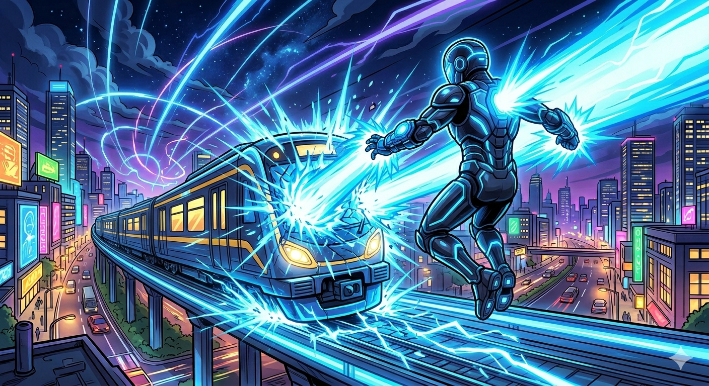

# ⚡ Intenso: The Silent Guardian

## Part I: The Story

Almáriz is an old city on the Mediterranean coast, in the south of Europe. The Romans founded it centuries ago, and later it became a stronghold of the Arabs, who left their mark on its narrow streets, its archways, and its towers. There has always been something mysterious about Almáriz — as if the city is keeping secrets. In recent decades, however, it has also become one of the most prosperous cities in the region, thanks to a booming technology revolution that has attracted companies and talent from all over the world.

Like most cities, it has its problems — crime, accidents, danger. But unlike most cities, Almáriz has Intenso.

Every night, Intenso flew silently over the city, watching and waiting. The people of Almáriz trusted him, even if they had never met him.

---

One cool October evening, Intenso was flying high above the central train station of Almáriz. He was checking the streets below when something caught his attention. A long passenger train was approaching the station — but it was not slowing down. In fact, it seemed to be going *faster*.

"That's wrong," he said quietly to himself.

He activated a small device hidden in his watch and patched into the police radio. Immediately, he heard urgent voices.

*"All units, prepare for impact at Almáriz Central. Emergency services, proceed to the station now."*

Intenso felt a cold feeling in his chest. The police had already given up on stopping the train. They were preparing for the worst. There were hundreds of people on that train — and perhaps only one or two minutes left.

*But I haven't given up*, he thought.

He dived at incredible speed towards the railway tracks ahead of the station. Near the entrance, there was a manual track switch — a lever that could redirect the train onto a longer circular route around the station. Intenso grabbed the lever with both hands and pulled with all his strength. The heavy metal moved slowly, then suddenly *clicked* into place. The train thundered past him and took the new route, going around the station instead of straight into it.

Now he had more time — but the train was still moving dangerously fast.

Intenso flew alongside the train, matching its speed. He pointed his wrist at the wheels and fired concentrated energy beams at them. The wheels began to slow down. Sparks flew. Then the brakes caught fire, burning bright orange in the dark night. He fired again and again, steady and focused.

Metre by metre, the train was losing speed.

Ahead, Intenso could see a crossroads where the track barrier was open. If the train reached it at this speed, it would be catastrophic. He pushed himself harder, firing beams continuously.

Then — silence. The train stopped. It had come to a halt just twenty metres before the open barrier.

Within seconds, fire engines that had been following the emergency appeared and firefighters rushed to help the passengers. Everyone on the train was safe.

From high above, Intenso watched as people climbed down onto the tracks, confused but unharmed. He felt a quiet, deep satisfaction — the kind that comes not from praise, but from knowing you have done the right thing.

The police arrived. Then the press. Cameras flashed. Reporters started asking who had saved the train.

Then, one of the passengers — a young boy — looked up and pointed at the dark sky.

"Intenso!" he shouted. "It's Intenso — the silent guardian of Almáriz!"

A few heads turned. More fingers pointed. Intenso could see the cameras starting to move in his direction.

*They will start asking questions again*, he thought. *They always do.*

He turned quietly and flew up into the dark sky, away from the lights and the noise.

He did not want a medal. He did not want his name in the newspaper. He had helped because those people needed help, and because it was the right thing to do. That was enough.

He landed on the roof of his private building, took the lift down to his basement, removed his watch, and sat alone in the dark for a moment.

He smiled to himself.

*Nobody knows*, he thought. *And that's perfectly fine.*

---

# 📚 Vocabulary Hint

* **vigilante (noun):** A person who tries to stop crime without being a police officer.
* **patch into (phrasal verb):** To connect secretly to a communication system.
* **proceed (verb):** To go somewhere or continue doing something.
* **redirect (verb):** To change the direction of something.
* **concentrated (adjective):** Focused strongly on one point.
* **catastrophic (adjective):** Very terrible and causing a lot of damage.
* **halt (noun):** A complete stop.
* **satisfaction (noun):** A feeling of happiness because you have done something well.
* **unharmed (adjective):** Not hurt or damaged.
* **activated (verb):** Started a machine or system.
* **lever (noun):** A long handle that you push or pull to operate a machine or mechanism.
* **track switch (noun):** A device on a railway that moves the rails to direct a train from one track to another.

---

### 🔗 Phrasal Verbs

| Phrasal Verb | Meaning in the Story | Example |
|---|---|---|
| **give up** | To stop trying to do something | The police had already **given up** on stopping the train. |
| **catch on fire** | To start burning | The brakes **caught fire** and burned orange in the night. |
| **patch into** | To secretly connect to a radio or communication system | He **patched into** the police radio to hear what was happening. |
| **slow down** | To reduce speed gradually | The train was not **slowing down** — it was speeding up. |
| **rush to** | To go somewhere very quickly because it is urgent | Firefighters **rushed to** help the passengers on the train. |

---

## Part II: 25 Practice Questions

### Section A: Reading Understanding (Questions 1–5)

Answer the questions in full sentences using information from the story.

**1.** Where is Almáriz, and what role does Intenso play there?

**2.** What made Intenso realise the train was in danger? What did he hear on the police radio?

**3.** How did Intenso buy himself more time before stopping the train?

**4.** Describe the two steps Intenso took to stop the train. What happened to the brakes?

**5.** Why did Intenso fly away before the police and press arrived? What does this tell us about his character?

---

### Section B: Grammar Focus — Multiple Choice (Questions 6–10)

Choose the correct answer: **a**, **b**, or **c**.

**6.** The train ________ the station when Intenso noticed it was not slowing down.
- a) approaches
- b) was approaching
- c) has approached

**7.** Intenso ________ into the police radio and heard urgent voices.
- a) was patching
- b) patched
- c) has patched

**8.** "All units, prepare for impact." The officer told all units ________ for impact.
- a) prepare
- b) to prepare
- c) preparing

**9.** The train station was the ________ dangerous place in the city that night.
- a) more
- b) much
- c) most

**10.** If the train ________ the open barrier, it would have been catastrophic.
- a) reaches
- b) has reached
- c) had reached

---

### Section C: Grammar Focus — Fill-in-the-Gaps (Questions 11–17)

Write **ONE word** to complete each sentence correctly.

**11.** Almáriz is a busy city ________ the south of Europe.

**12.** The police were preparing ________ the worst when Intenso patched into their radio.

**13.** He fired energy beams again and again, steady ________ focused.

**14.** Everyone ________ the train was safe after Intenso stopped it.

**15.** He did not want ________ name in the newspaper.

**16.** Intenso had ________ flying over the city every night, watching and waiting.

**17.** The train came to a halt just twenty metres ________ the open barrier.

---

### Section D: Grammar Focus — Sentence Transformation (Questions 18–25)

Complete the second sentence so that it means the same as the first. Use **1 to 3 words**.

**18.** "Intenso was able to fly at incredible speed."
➡️ Intenso ________ at incredible speed.

**19.** "Intenso stopped the train by firing energy beams."
➡️ The train ________ by Intenso using energy beams.

**20.** "The train was so fast that Intenso couldn't stop it immediately."
➡️ The train was ________ for Intenso to stop immediately.

**21.** "Intenso started watching over the city and he still does it now."
➡️ Intenso ________ over the city since the beginning.

**22.** "Almáriz Central is a busier station than the north terminal."
➡️ The north terminal is ________ Almáriz Central.

**23.** "He said: 'I feel a deep satisfaction.'"
➡️ He said that he ________ a deep satisfaction.

**24.** "Intenso grabbed the lever and pulled it. That is why the train changed track."
➡️ The train changed track because Intenso ________ the lever and pulled it.

**25.** "It is not necessary for Intenso to seek recognition."
➡️ Intenso ________ seek recognition.

---
