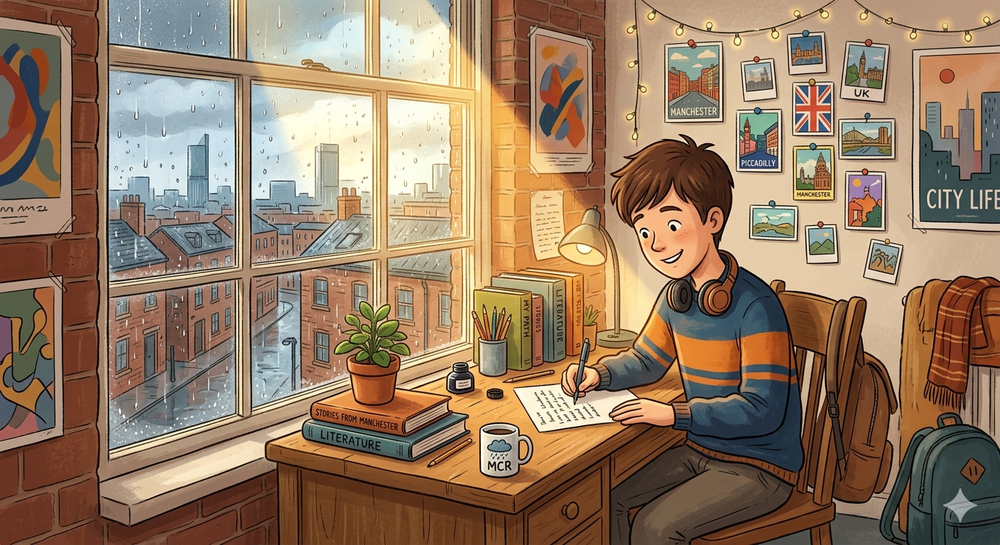

# ✉️ A Letter from Far Away

## Part I: The Story

---

*Manchester, 14th March*

Dear Álvaro,

I wrote this letter three times before I finally sent it. I kept deleting everything because I didn't know where to begin. But today the sun came out for the first time in weeks here in Manchester, and I sat by the window of my room and thought of you. So here we go.

It has already been almost a year since I left home. Can you believe it? When Mum drove me to the airport, I held my backpack so tightly that my hands hurt. I was terrified. I had never flown alone before, and I didn't speak to anyone on the plane. I just put my headphones on and pretended I was fine.

But I wasn't fine. Not at first.

The first two weeks here were the hardest thing I have ever done. I slept badly. I ate strange food that I didn't understand. My flatmates spoke so fast that I could barely follow them. I felt invisible, like a ghost who had got lost in the wrong city. I cried twice — yes, twice, but please don't tell anyone.

Then something changed.

One evening, my flatmate Priya knocked on my door and asked me if I wanted to go to a film club with her. I almost said no. I was tired and I was missing home badly. But something inside me told me to go. So I went.

At the film club, I met a group of people who had come from different countries — Italy, Japan, Brazil, even Iceland! We watched an old Spanish film and they all looked at me like I was some kind of expert. I laughed for the first time in weeks. We talked until midnight. I walked home alone under the streetlights and I felt something new: I felt free.

Since that night, everything has changed. I have made real friends. I have tried foods I had never eaten before. I have spoken English every single day, and my teachers say I have improved enormously. Last month I got the best mark in my class on the science project. I nearly fell off my chair when the teacher read out my name!

I think about you all the time, Álvaro. I grew up with you. We built dens in the garden, we rode our bikes down that dangerous hill behind Uncle Rafael's house, we ate so much watermelon at Grandma's that we were sick — do you remember? Those memories have kept me strong when things got difficult here. Family is the thing you carry with you, even when you are very far away.

But I also have learnt something important: growing up is not something that happens to you slowly. It hits you all at once, like cold water. One day you are a child. The next day you are making your own breakfast, paying for your own bus ticket, deciding what to study and who to be. It is exciting and scary at the same time. I think we are both becoming different people, you and I. And I think that is a good thing.

Now, the most important part of this letter.

You must come and visit me. I am not joking. Come for a week, or maybe ten days. I have already looked at train connections from the airport. We could go to the Peak District — it is a beautiful national park that is not far from here. We could cook together in my kitchen. I could show you the film club, and my favourite bookshop, and the market where they sell the most amazing street food I have ever tasted.

I know what you are thinking: Mum and Dad will never let me go. But think about it — you will probably do a course abroad yourself in a couple of years. This would be perfect practice. You would already know what to expect. And you would not be alone: I will be there with you every step of the way.

Talk to them. *Be brave*. You might be surprised.

I miss you more than I can say. But I am happy. And I want you to see that with your own eyes.

Write back soon. Or better — just come.

All my love,  
**Marco** 🌍

---

---

# 📚 Vocabulary Hint

* **terrified (adjective):** Extremely scared or frightened.
* **invisible (adjective):** Impossible to see; not noticed by others.
* **flatmate (noun):** A person who lives with you in the same flat or apartment.
* **enormously (adverb):** Very much; to a very great degree.
* **den (noun):** A secret or private place, often built by children for fun.
* **barely (adverb):** Almost not; only just.
* **pretended (verb):** Acted as if something was true when it was not.
* **connections (noun):** Transport links between two places (trains, buses, planes).

---

### 🔗 Phrasal Verbs Table

| Phrasal Verb | Meaning in the Story | Example Sentence |
|---|---|---|
| **come out** | To appear (for the sun: to stop being hidden by clouds) | *The sun **came out** and everything felt brighter.* |
| **grow up** | To change from a child into an adult | *We **grew up** together in the same neighbourhood.* |
| **knock on** | To hit a door with your knuckles to get attention | *She **knocked on** my door and smiled.* |
| **look at** | To direct your eyes towards something | *They all **looked at** me with curiosity.* |
| **fall off** | To drop from something accidentally | *I nearly **fell off** my chair in surprise.* |
| **find out** | To discover information you did not know | *He **found out** he was the best student in class.* |

---

## Part II: 25 Practice Questions

---

### Section A: Reading Understanding (Questions 1–5)

Answer these questions in your own words. Use complete sentences.

**1.** Why did Marco find the first two weeks in Manchester so difficult? Give two reasons.

**2.** What happened at the film club that made Marco feel better?

**3.** What memory does Marco share of his childhood with Álvaro? Provide one example.

**4.** What does Marco say he has learnt about growing up?

**5.** Why does Marco think Álvaro's parents should let him visit?

---

### Section B: Grammar Focus — Multiple Choice (Questions 6–10)

Choose the correct answer: **a**, **b**, or **c**.

**6.** "I \_\_\_ this letter three times before I finally sent it."
- a) write
- b) wrote
- c) was writing

**7.** "I have already \_\_\_ at train connections from the airport."
- a) looked
- b) look
- c) was looking

**8.** "I **had never flown** alone before, and I \_\_\_ to anyone on the plane."
- a) don't speak
- b) wasn't speaking
- c) didn't speak

**9.** "This \_\_\_ be perfect practice for your own course abroad."
- a) will
- b) would
- c) must

**10.** "We watched an old Spanish film \_\_\_ all my friends found very interesting."
- a) who
- b) where
- c) that

---

### Section C: Grammar Focus — Fill-in-the-Gaps (Questions 11–17)

Write **one word only** to complete each sentence.

**11.** Marco sat \_\_\_ the window when the sun finally came out.

**12.** He had never flown alone \_\_\_ , so he was very nervous.

**13.** I \_\_\_ been here almost a year — can you believe it?

**14.** The teachers said he \_\_\_ improved enormously since September.

**15.** We could go \_\_\_ the Peak District if you come to visit.

**16.** Marco said that growing up hits you all \_\_\_ once.

**17.** I nearly fell \_\_\_ my chair when the teacher read out my name.

---

### Section D: Grammar Focus — Sentence Transformation (Questions 18–25)

Rewrite the sentence using the word given. **Use 1–3 words only** in the gap. Do not change the meaning.

**18.** "Marco wrote the letter three times." *(PASSIVE)*  
➡️ The letter \_\_\_ three times by Marco.

**19.** "I'm not as happy at home as I am here," Marco thought. *(COMPARATIVE)*  
➡️ Marco thought he was \_\_\_ here than at home.

**20.** "I will come and visit," said Álvaro. *(REPORTED SPEECH)*  
➡️ Álvaro said that he \_\_\_ come and visit.

**21.** "It's possible that you will surprise your parents," Marco wrote. *(MIGHT)*  
➡️ You \_\_\_ surprise your parents.

**22.** "Marco decided not to stay in his room that evening." *(DECIDED)*  
➡️ Marco decided \_\_\_ stay in his room that evening.

**23.** "The science project was done by Marco, not by his partner." *(HIMSELF)*  
➡️ Marco did the science project \_\_\_ .

**24.** "I will show you everything, if you come to visit." *(FIRST CONDITIONAL)*
➡️ Marco will show Álvaro everything if he \_\_\_ to visit.

**25.** "No food I have ever eaten is as amazing as the market street food." *(SUPERLATIVE)*  
➡️ The market street food is the \_\_\_ food Marco has ever tasted.
